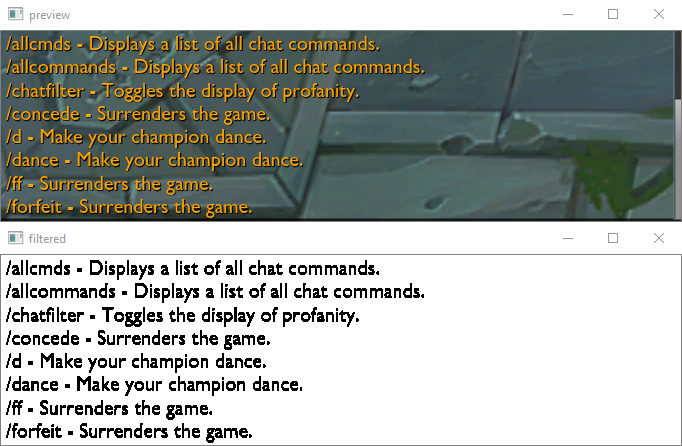

# Counter ff

## Install libraries:
```
pip install -r requirements.txt
```

## Install tesseract:
[https://github.com/tesseract-ocr/tesseract/wiki](https://github.com/tesseract-ocr/tesseract/wiki)

## Run script:
```
python main.py <left> <top> <width> <height>
```

Adjust left, top, width and height parameters to match chat position (type "/allcommands" to fill the chat with yellow text), preview should look like this:



For example (with 1440p monitor):
```
python main.py 10 1062 680 190
```
